

<table>
    <theader>
        <tr>
            <td></td>
            <th>
                UNIVERSIDAD NACIONAL DE SAN AGUSTIN 
                FACULTAD DE INGENIERÍA DE PRODUCCIÓN Y SERVICIOS 
                ESCUELA PROFESIONAL DE INGENIERÍA DE SISTEMAS
            </th>
            <td></td>
        </tr>
    </theader>
    <tbody>
        <tr><td colspan="3">Formato: Guía de Práctica de Laboratorio</td></tr>
        <tr><td>Aprobación:  2022/03/01</td><td>Código: GUIA-PRLD-001</td><td>Página: 1</td></tr>
    </tbody>
</table>

 <h3>INFORME DE LABORATORIO</h3>

<table>
 <theader>
  <tr><th colspan="6" bgcolor="red">INFORMACIÓN BÁSICA</th></tr>
 </theader>
 <tbody>
  <tr><td>ASIGNATUA:</td><td colspan="5">Estructura de Datos y Algoritmos</td></tr>
  <tr><td>TÍTULO DE LA PRACTICA:</td><td colspan="4">Grafos<td></tr>
  <tr><td>NÚMERO DE PRÁCTICA:</td><td>Practica de Laboratorio 08</td><td>AÑO LECTIVO:</td><td>2022 A</td><td>NRO. SEMESTRE:</td><td>III</td></tr>
  <tr><td>FECHA DE PRESENTACIÓN:</td><td>21-Agosto-2022</td><td>HORA DE PRESENTACIÓN:</td><td colspan="3">11:30 p.m.</td></tr>
  <tr><td>INTEGRANTES:</td><td colspan="3">-Diego Ivan Pacori Anccasi -Edson Joel López Quispe -Oliver Alessandro Mayta Nolasco -Edwin Francisco Aguilar Tancayo -Jordy Emanuel Ayma Cutipa</td><td>NOTA:</td><td>...</td></tr>
  <tr><td>DOCENTE:</td><td colspan="5">Richart Smith Escobedo Quispe - rescobedoq@unsa.edu.pe</td></tr>
 </tbody>
</table>
<table>
 <theader>
  <tr><th>SOLUCIÓN Y RESULTADOS</th></tr>
 </theader>
 <tbody>
  <tr><td><strong>I. SOLUCIÓN DE EJERCICIOS/PROBLEMAS:</strong> 
  <ul>
    <ol>
        <li>Implementar codigo de Grafo(Lista de Adyacencia)</li>
        <li>Implementar BSF,DFS y Difkstra</li>
        <h1>BSF Y DFS</h1>
        <h2>Clase Grafo:</h2>
        <h3>Atributos:</h3>
        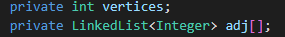 
        <em>vertices:</em> Número de vertices del Grafo. 
        <em>adj:</em> Arreglo de listas, que representan la lista de adyacencia de cada vértice.
        <h3>Métodos:</h3>
        <h4> <em>mostrarMatrizAdy():</em> Este método usa el arreglo de listas de adyacencias para motrar la matriz de adyacencia.</h4>
        <h4> <em>addArista():</em> Agrega una conexión entre 2 vertices (agregandola en el arreglo de listas de adyacencia en la posición adecuada).</h4>
        <h4> <em>DFSUtil():</em> Marcar el nodo actual como visitado(en el arreglo de booleanos) y lo imprime ademas realiza la recurrencia para todos los vértices adyacentes a este vértice.</h4>
        <h4> <em>DFS():</em> Crea el arreglo de booleanos y utiliza a la funcion recursiva DFSUtil.</h4>
        <h4> <em>BFS():</em> El método crea un arreglo de booleanos(para verificar si el vértice fue recorrido), crea una cola para ir desencolado cuando el vértice se halla recorrido y por último recorre la lista de adyacencia realizando el procedimiento.  </h4>
        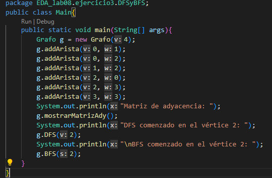 
        Representa el siguiente grafo: 
        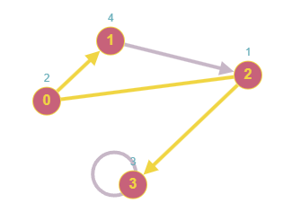 
        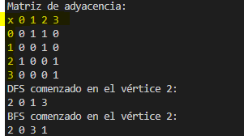 
        <h1>Dijkstra</h1>
        <h2>Clase Arista:</h2>
        <h3>Atributos:</h3>
        <em>inicio:</em> Vértice donde inicia la arista. 
        <em>destino:</em> Destino de la arista.
        <em>peso:</em> El peso de la arista. 
        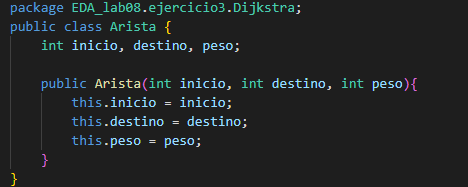 
        <h2>Clase Nodo:</h2>
        Esta clase nos sirve como ayuda para hacer un min-heap para realizar con mayor facilidad el algoritmo.
        <h3>Atributos:</h3>
        <em>vertex:</em> Representa el vértice. 
        <em>weight:</em> Representa el costo para llegar al vértice. 
        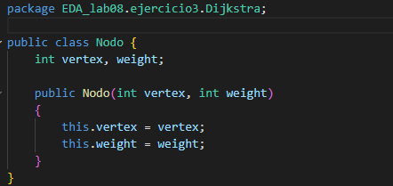 
        <h2>Clase Grafo:</h2>
        <h3>Atributos:</h3>
        <em>adjList:</em> Una lista de listas para representar una lista de adyacencia. 
        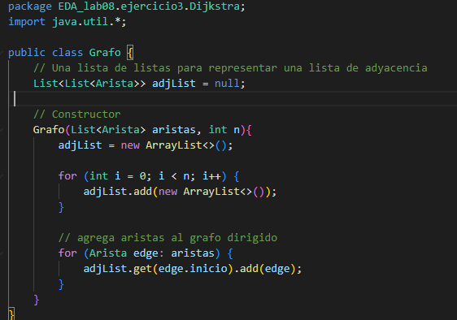 
        <h2>Clase Main:</h2>
        <h3>Métodos:</h3>
        <h4> <em>getRoute():</em> Este método agrega la ruta del recorrido mínimo en la Lista "route".</h4>
        <h4> <em>Dijkstra():</em> Nos ejetura el algoritmo de Dijkstra usando nuestro min-heap como apoyo para el algoritmo.</h4>
        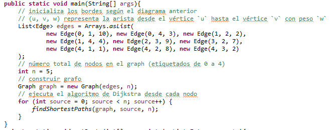 
        Representa el siguiente grafo: 
        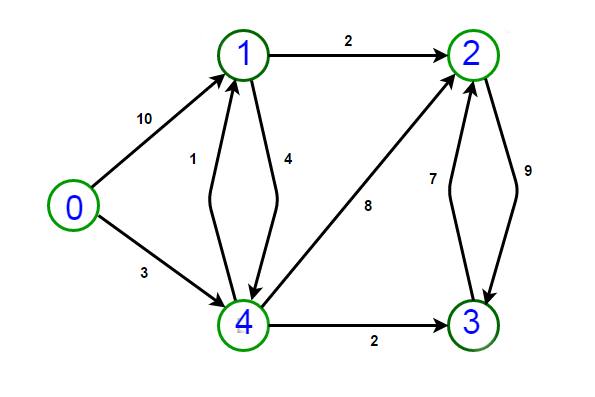 
        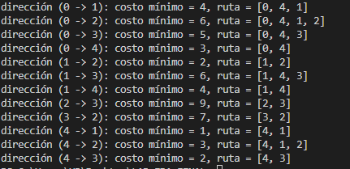 
        <li>El grafo de palabras se define de la siguiente manera: cada vértice es una palabra en el idioma Inglés y dos palabras son adyacentes si difieren exactamente en una posición. Por ejemplo, las cords y los corps son adyacentes, mientras que los corps y crops no lo son.</li> 
        a) Dibuje el grafo definido por las siguientes palabras: words cords corps coops crops drops drips grips gripe grape graph.
        <h2>Realizar un metodo en la clase Grafo. Este metodo permitira saber si un grafo esta
        crops drops drips grips gripe grape graph.  
        b) Mostrar la lista de adyacencia del grafo. 
        <li>Realizar un metodo en la clase Grafo. Este metodo permitira saber si un grafo esta
        incluido en otro. Los parametros de entrada son 2 grafos y la salida del metodo es
        true si hay inclusion y false el caso contrario.</h2></li>
            <h3>Se utilizo como ejemplo el codigo del problema numero 1</h3>
            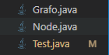 
            Se agrego un metodo el cual devuelve el arreglo de vertices o nodos 
            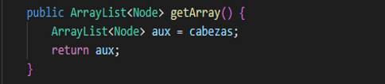 
            Luego se empezo a crear el codigo tomando en cuenta estos puntos: (a) Cuando existe un vertice o nodo el cual
            no este conectado con ninguno, (b) Cuando en el grafo original existe un camino de v1 hacia v2, pero el grafo a comparar posee de 
            v2 hacia v1 (al ser diferentes caminos se retornara false), (c) Cuando el grafo a comparar posee un vertice el cual no este dentro del original, 
            (d) Cuando un nodo o vertice posee una conexion extra hacia otro que el graf original no tiene. 
            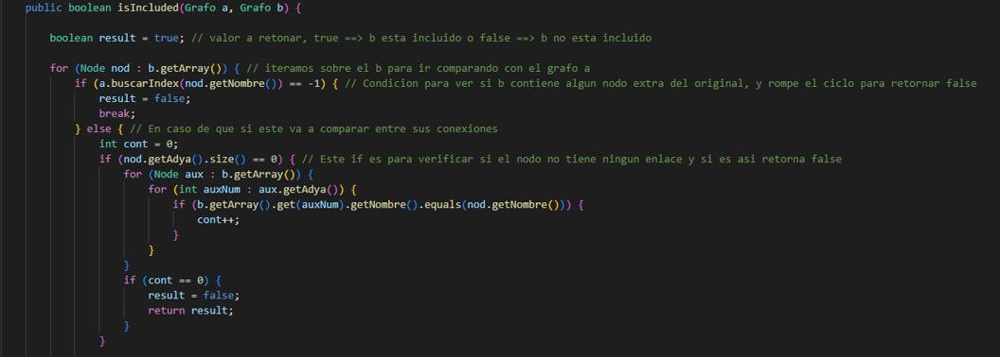 
            A continuacion tenemos el booleano result el cual vamos a usar para retornar, 
            luego un foreach el cual va a iterar entre todos los vertices o nodos del grafo b (el grafo a verificar), siguiendo de una condicion la cual va a buscar si el vertice existe en el grafo original, si cumple retorna false y termina el metodo, en caso contrario va a verificar si el vertice esta aislado de todo el grafo para de igual manera retornar false, en caso contrario continua con el codigo. 
            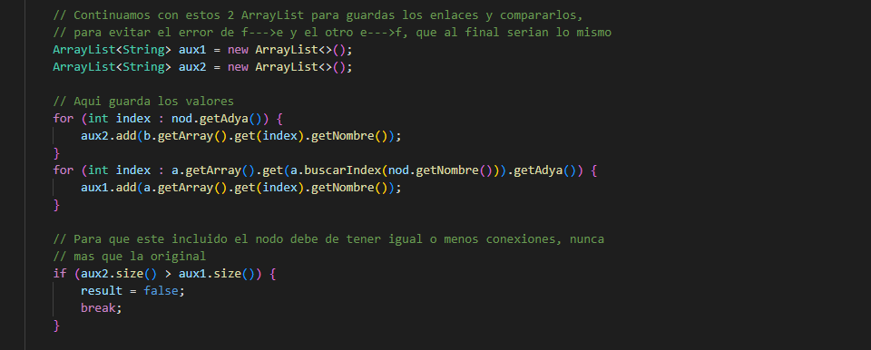 
            luego de pasar el primer filtro, creamos 2 arrays los cuales seran las conexiones que posee el vertice original (aux1) y el vertice a comparar (aux2), luego ingresara en los 2 for siguientes para llenarlos y despues un if el cual verificara si el vertice a comparar posee mas conexiones que la original, si cumple esto, detiene todo el codigo y va a retornar false. 
            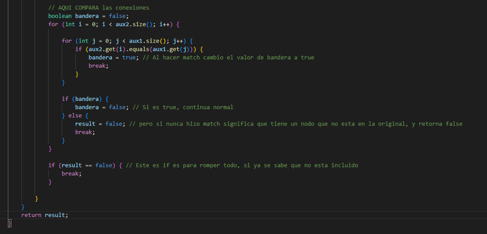 
            Por ultimo va a verificar las conexiones y que estas esten dentro del original, con ayuda de una bandera para verificar si es que tiene una conexion extra, en este caso retorna false y por ultimo un if el cual verifica el boolean result y lo retorna. 
            <h3>Ejemplo de Ejecucion y de uso</h3>
            Creamos nuestros grafos y sus vertices 
            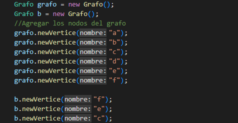 
            Realizamos las conexiones 
            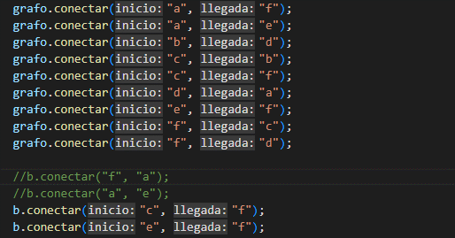 
            Ahora llamos al metodo dentro de un print para que imprima el valor booleano y como primer parametro nuestro grafo original, y como segundo parametro el grafo a comparar y obtenemos esto (nos deberia retornar true, ya que el grafo b posee 3 vertices que estan dentro del grafo original y con sus conexiones entre los 3 sin dejar uno aislado y tampoco una conexion extra): 
            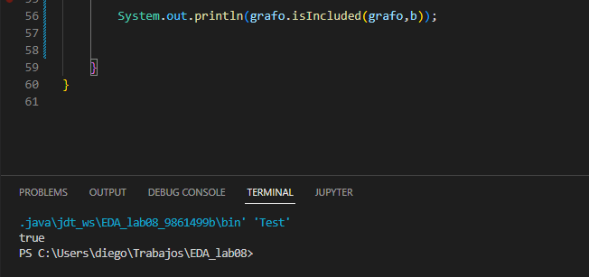 
  </ul>
    <tr><td><strong>III. CUESTIONARIO:</strong> 
        <h3>¿Cuantas variantes del algoritmo de Dijkstra hay y cuál es la diferencia entre ellas?</h3> 
        Las version del algoritmo de Diskstra son muchas por el hecho de ser un algoritmo antiguo y van apareciendo nuevas versiones, ejemplo de ello son:
        Estructura de datos cola de prioridad(Pseudocódigo)
        <pre>
        DIJKSTRA (Grafo G, nodo_fuente s)       
           para u ∈ V[G] hacer
              distancia[u] = INFINITO
              padre[u] = NULL
              visto[u] = false
          distancia[s] = 0
          adicionar (cola, (s, distancia[s]))
          mientras que cola no es vacía hacer
              u = extraer_mínimo(cola)
              visto[u] = true
              para todos v ∈ adyacencia[u] hacer
                 si ¬ visto[v]      
                    si distancia[v] > distancia[u] + peso (u, v) hacer
                        distancia[v] = distancia[u] + peso (u, v)
                        padre[v] = u
                        adicionar(cola,(v, distancia[v]))
        </pre>
        Otro es çla version sin cola de prioridad(Pseudocódigo)
        <pre>
        función Dijkstra (Grafo G, nodo_salida s)
            entero distancia[n] 
            //Inicializamos el vector con distancias iniciales
            booleano visto[n] 
            //vector de boleanos para controlar los vértices de los que ya tenemos la distancia mínima
            para cada w ∈ V[G] hacer
                Si (no existe arista entre s y w) entonces
                    distancia[w] = Infinito //puedes marcar la casilla con un -1 por ejemplo
                Si_no
                    distancia[w] = peso (s, w)
                fin si 
            fin para
            distancia[s] = 0
            visto[s] = cierto
            //n es el número de vértices que tiene el Grafo
            mientras que (no_estén_vistos_todos) hacer 
                vértice = tomar_el_mínimo_del_vector distancia y que no esté visto;
                visto[vértice] = cierto;
                para cada w ∈ sucesores (G, vértice) hacer
                    si distancia[w]>distancia[vértice]+peso (vértice, w) entonces
                        distancia[w] = distancia[vértice]+peso (vértice, w)
                    fin si
                fin para 
            fin mientras
        fin función.
        </pre>
        <h3>Invetigue sobre los ALGORITMOS DE CAMINOS MINIMOS e indique, ¿Qué similitudes encuentra, qué diferencias, en qué casos utilizar y porque?</h3> 
        Exiten 2 algoritmos para buscar el camino más corto: el Algoritmo Floyd-Warshall y el de Dijkstra. 
        - Algoritmo de Dijkstra: Es un algoritmo para la determinación del camino más corto, dado un vértice origen, hacia el resto de los vértices en un grafo que tiene pesos en cada arista. 
        Algortitmo de Floyd-Warshall: Es un algoritmo de análisis sobre grafos para encontrar el camino mínimo en grafos dirigidos ponderados. El algoritmo encuentra el camino entre todos los pares de vértices en una única ejecución. 
        Como se puede notar la principal diferencia es que el algoritmo de Floyd-Warshall nos halla el camino camino mas corto dado 2 vertices, mientras que el algoritmo de Dijkstra nos halla TODOS los caminos más cortos de un vértice hacia los demás. 
    </td></tr>
    <tr><td><strong>IV. CONCLUSIONES:</strong> 
        ...
    </td></tr>
 </tbody>
</table>

<table>
 <theader>
  <tr><td><strong>V. RETROALIMENTACIÓN GENERAL</strong> 
  </td><tr>
 </theader>
 <tbody>
  <tr><td> 
        Un grafo es la suma de un conjunto de vertices o nodos que se relacionan con otros
        a traves de un conjunto de conexiones conocidas como aristas. Estos nos permiten estudiar 
        relaciones que existen entre unidades que interactuan con otras.
        Podemos darles muchos usos por ejemplo, para encontrar el menor camino de un lugar a otro usando 
        el algoritmo Dijkstra como lo hemos implementado o usando otros algoritmos como el de Floyd y Warshall
        (estos ultimos buscan el camino mas corto usando grafos etiquetados o ponderados), tambien podemos darle
        un uso para sitemas de informacion geografica, para dibujo computacional, sintesis de circuitos secuenciales,
        etc.
  </td></tr>
 </tbody>
</table>

<table>
 <theader>
  <tr><td><strong>REFERENCIAS Y BIBLIOGRAFÍA</strong></td><tr>
 </theader>
 <tbody>
  <tr><td>https://delfino.cr/2021/11/la-utilidad-y-aplicacion-de-los-grafos-y-sistemas-de-informacion-geografica</td></tr>
  <tr><td>https://www.ecured.cu/Algoritmo_de_Dijkstra</td></tr>
  <tr><td>https://www.grapheverywhere.com/que-son-los-grafos/</td></tr>
  <tr><td>https://www2.ulpgc.es/hege/almacen/download/25/25317/teoriadegrafos.pdf</td></tr>
 </tbody>
</table>
