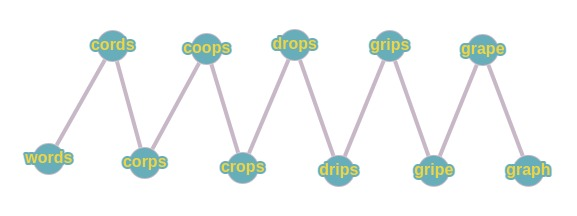
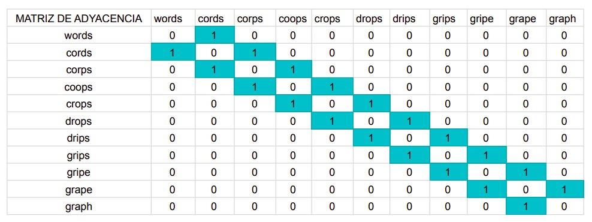

<table>
    <theader>
        <tr>
            <td></td>
            <th>
                UNIVERSIDAD NACIONAL DE SAN AGUSTIN 
                FACULTAD DE INGENIERÍA DE PRODUCCIÓN Y SERVICIOS 
                ESCUELA PROFESIONAL DE INGENIERÍA DE SISTEMAS
            </th>
            <td></td>
        </tr>
    </theader>
    <tbody>
        <tr><td colspan="3">Formato: Guía de Práctica de Laboratorio</td></tr>
        <tr><td>Aprobación:  2022/03/01</td><td>Código: GUIA-PRLD-001</td><td>Página: 1</td></tr>
    </tbody>
</table>

 <h3>INFORME DE LABORATORIO</h3>

<table>
 <theader>
  <tr><th colspan="6" bgcolor="red">INFORMACIÓN BÁSICA</th></tr>
 </theader>
 <tbody>
  <tr><td>ASIGNATUA:</td><td colspan="5">Estructura de Datos y Algoritmos</td></tr>
  <tr><td>TÍTULO DE LA PRACTICA:</td><td colspan="4">Grafos<td></tr>
  <tr><td>NÚMERO DE PRÁCTICA:</td><td>Practica de Laboratorio 08</td><td>AÑO LECTIVO:</td><td>2022 A</td><td>NRO. SEMESTRE:</td><td>III</td></tr>
  <tr><td>FECHA DE PRESENTACIÓN:</td><td>21-Agosto-2022</td><td>HORA DE PRESENTACIÓN:</td><td colspan="3">11:30 p.m.</td></tr>
  <tr><td>INTEGRANTES:</td><td colspan="3">-Diego Ivan Pacori Anccasi -Edson Joel López Quispe -Oliver Alessandro Mayta Nolasco -Edwin Francisco Aguilar Tancayo -Jordy Emanuel Ayma Cutipa</td><td>NOTA:</td><td>...</td></tr>
  <tr><td>DOCENTE:</td><td colspan="5">Richart Smith Escobedo Quispe - rescobedoq@unsa.edu.pe</td></tr>
 </tbody>
</table>
<table>
 <theader>
  <tr><th>SOLUCIÓN Y RESULTADOS</th></tr>
 </theader>
 <tbody>
  <tr><td><strong>I. SOLUCIÓN DE EJERCICIOS/PROBLEMAS:</strong> 
  <ul>
    <ol>
        <li>Implementar codigo de Grafo(Lista de Adyacencia)</li>
        <li>Implementar BSF,DFS y Difkstra</li>
        <li>El grafo de palabras se define de la siguiente manera: cada vértice es una palabra
            en el idioma Inglés y dos palabras son adyacentes si difieren exactamente en una
            posición. Por ejemplo, las cords y los corps son adyacentes, mientras que los
            corps y crops no lo son.
            
            a) Dibuje el grafo definido por las siguientes palabras: words cords corps coops
               crops drops drips grips gripe grape graph.
               

            b) Mostrar la lista de adyacencia del grafo.
               
        </li>
        
        <li>Realizar un metodo en la clase Grafo. Este metodo permitira saber si un grafo esta
            incluido en otro. Los parametros de entrada son 2 grafos y la salida del metodo es
            true si hay inclusion y false el caso contrario.</li>
    </ol>
  </ul>
    <tr><td><strong>III. CUESTIONARIO:</strong> 
        <h3>¿Cuantas variantes del algoritmo de Dijkstra hay y cuál es la diferencia entre ellas?</h3> 
        ...
        <h3>Invetigue sobre los ALGORITMOS DE CAMINOS MINIMOS e indique, ¿Qué similitudes encuentra, qué diferencias, en qué casos utilizar y porque?</h3> 
        ...
    </td></tr>
    <tr><td><strong>IV. CONCLUSIONES:</strong> 
        ...
    </td></tr>
 </tbody>
</table>

<table>
 <theader>
  <tr><td><strong>V. RETROALIMENTACIÓN GENERAL</strong> 
  </td><tr>
 </theader>
 <tbody>
  <tr><td> 
        ... 
  </td></tr>
 </tbody>
</table>

<table>
 <theader>
  <tr><td><strong>REFERENCIAS Y BIBLIOGRAFÍA</strong></td><tr>
 </theader>
 <tbody>
  <tr><td>...</td></tr>
  <tr><td>...</td></tr>
  <tr><td>...</td></tr>
  <tr><td>...</td></tr>
 </tbody>
</table>
